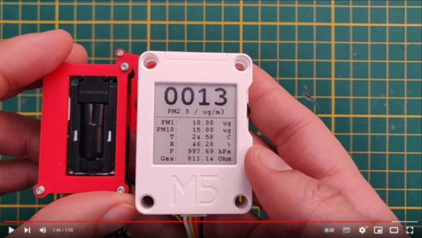
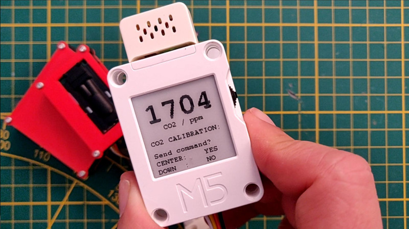
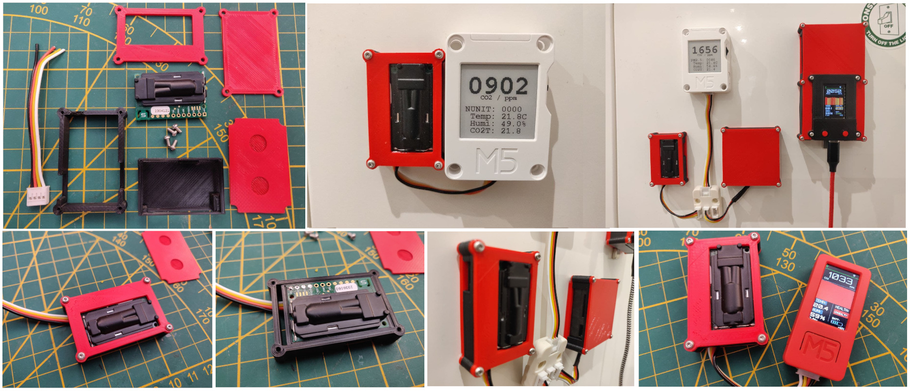
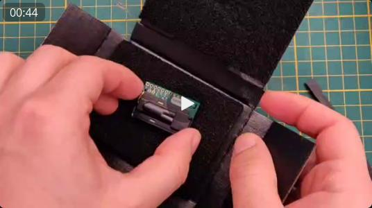
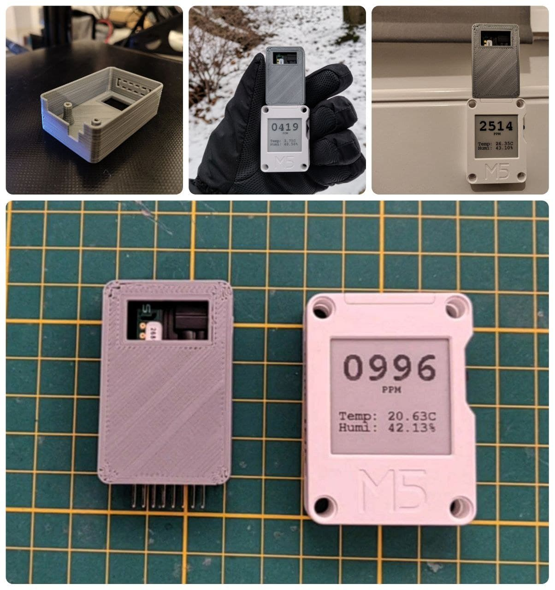
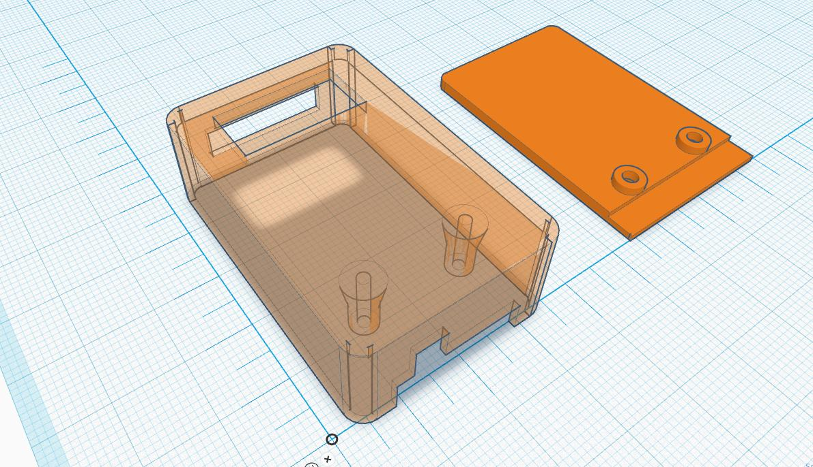

# M5CoreInk Multi Sensor

This project use the [CanAirIO Sensors Library](https://github.com/kike-canaries/canairio_sensorlib) to have a complete air quality device. Thanks to this library you able to have many posibilities of sensors and variables automatically, for example you can connect one CO2 sensor or the combination of it with particulate meter sensors (PM2.5) or environment sensors (T, H, P, Alt, etc). The library able to detect and select each driver and thrid party library for handling these sensors and give you the complete list of variables with a few lines of code. Plese see the [demo video](#demo)

Also the installation of this firmware in your device is possible only with one click via an easy [Web installer](#installation) without WiFi or compiling anything.


# Demo

[](https://youtu.be/i15iEF47CbY)

# Features

- [x] Multi variable - multi sensor support with auto configuration
- [x] CO2 sensor calibration via wheel button
- [x] Continuos mode or low power consumption mode
- [x] Automatic sensor refresh interval on USB connection 
- [x] Partial update (fast refresh without blink) in USB mode
- [x] Support two I2C channel (Hat or external port).
- [x] Auto selection of sample time by sensor type
- [x] Low power consumption in Battery mode (Deep sleep via RTC)
- [x] Able to set beep alarm for PM2.5 or CO2
- [x] Redraw complete screen and first setup via midle button
- [x] Demo mode with button down
- [ ] UART implementation for ext port via menu
- [ ] Auto selection of sample time in order of sensor type
- [ ] NTP sync via WiFi or Bluetooth
- [ ] Compatibility with [CanAirIO](https://canair.io) project 

# Installation

We have some alternartives for install the firmware:

## Easy way via CanAirIO Web Installer

It's the more easy alternative, you only need a USB cable and **Chrome or Edge browser**, then only enter to [CanAirIO Web Installer](https://canair.io/installer.html) page and choose on `special versions` section the option: **M5CoreInk Basic Air Station** and follow the instructions.

[](https://canair.io/installer.html)

## Alternative: Build your own firmware 

Alternative to compiling and inatall your own firmware via PlatformIO with your favourite IDE (i.e. VSCode). Follow [this](https://platformio.org/platformio-ide) instructions. Also, you may need to install [git](http://git-scm.com/) in your system.

### Clone the repo

```sh
git clone https://github.com/hpsaturn/co2_m5coreink.git
```
and after that:

### Via IDE (vscode)

Connect the M5CoreInk or compatible board via USB. In Windows 10, drivers are installed automatically. I guess with other OS will be automatically installed too.

Open cloned folder with your PlatformIO IDE and build & upload it. For details please see the [documentation](https://docs.platformio.org/en/latest/integration/ide/vscode.html#quick-start), but the process flow is more easy than Arduino IDE flow, but you can also import it to the Arduino IDE if you want.


### Via PlatformIO CLI

After the clone, enter to directory and you can build and upload the current firmware from CLI:

```shell
pio run --target upload
```

and that it is! :D


# Usage

This firmware works out of box without any configuration, but it has 3 modes:

### Button Middle

For full refresh of the screen, only use that for example the screen is corrupted when the battery over.

### Button Up

For enter to CO2 calibration mode. Only send the command when you are with the sensor on outdoors for more than 10 minutes. Please read the documentation.

### Button Down

In this mode the green LED turn on and the device try to detect in execution any sensor, also it show the variables continously. For exit, only press the middle button. This mode consume the battery.




---


# 3D Printed sensors

## Ext-port multi-sensor alternative

 

You can have one of this on [Tindie](https://www.tindie.com/products/hpsaturn/3d-printed-box-parts-for-a-diy-scd30-co2-device/) for support my work or build one.

## CO2 Hat alternative

In this repo you able to download the 3DPrint files for making a CO2 hat for M5CoreInk/M5StickC, this use a Sensirion SCD30 sensor for get CO2 values.

<a href="https://youtu.be/im0LNFRrHCg" target="_blank"></a>

## Components

| Description  | Store link |
|----------------------------|-------------------------------|
| M5CoreInk    |[M5Stack](https://m5stack.com/collections/m5-core/products/m5stack-esp32-core-ink-development-kit1-54-elnk-display) |
| M5Stack Proto | [M5Stack](https://m5stack.com/collections/m5-core/products/m5stack-esp32-core-ink-development-kit1-54-elnk-display) |
| Sensirion SCD30 | [Mouser](https://eu.mouser.com/ProductDetail/Sensirion/SCD30/?qs=rrS6PyfT74fdywu4FxpYjQ%3D%3D)
|      |      |
| M5StickC (compatible) | [M5Stack](https://m5stack.com/collections/m5-core/products/stick-c)
| M5StickC Plus (compatible) | [M5Stack](https://m5stack.com/collections/m5-core/products/m5stickc-plus-esp32-pico-mini-iot-development-kit)
|      |      |



## 3D print Files

<a href="https://github.com/hpsaturn/co2_m5coreink/tree/master/box" target="_blank"></a>

# Credits

Thanks to [CanAirIO communitie](https://canair.io/) for the feedback and tests.

